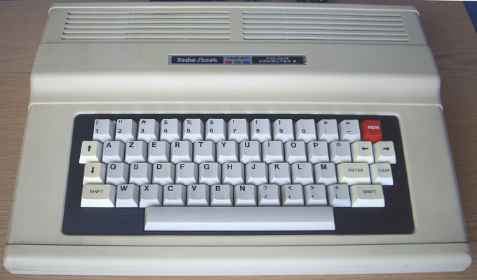

# Keyboard
The CoCo keyboard is not the same as today's keyboards.  Some alteration is required to handle this.

Notice that the top row doesn't match today's keyboards.  (It mapped to the original ASCII table layout)

When the system has the CoCo keyboard layout installed, the following key mapping is in place:

|Keyboard | `1` | `2` | `3` | `4` | `5` | `6` | `7` | `8` | `9` | `0` |
|------------------------------------------------------------------------|
|Standard | `!` | `@` | `#` | `$` | `%` | `^` | `&` | `*` | `(` | `)` |
|CoCo     | `!` | `"` | `#` | `$` | `%` | `&` | `'` | `(` | `)` |     |

|Keyboard |
|----------------|
|Standard | `;` | `:` | `-` | `_` | `=` | `+` | `\` |
|CoCo     | `;` | `+` | `:` | `*` | `-` | `=` | `@` |

Notes: 
* The backslash has been mapped to the @ key.
* Letters, numbers, space, arrows, enter, and shift keys are mapped as expected.
* Shift-0 inverts alpha case.  Also mapped to CapsLock.

 \
CoCo keyboard (original)

 \
CoCo 2 keyboard

 \
CoCo 3 keyboard
